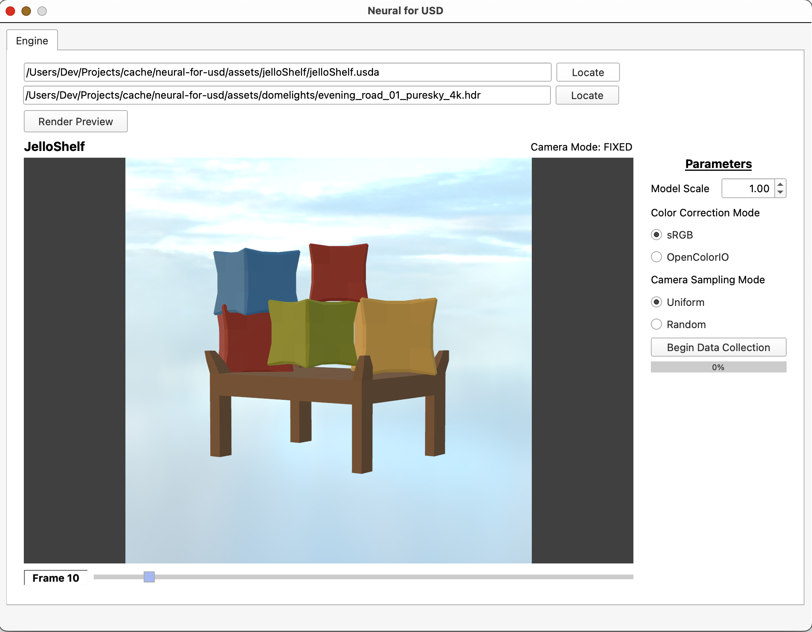

# Neural Radiance Fields (NeRF) in Universal Scene Description (OpenUSD)



**[Demo Video](https://youtu.be/NtF7fcyY4Mk)**

A comprehensive interface to solve data collection for Neural Radiance Fields and Novel View Synthesis for the Pixar OpenUSD framework.

### Requirements

- [CMake](https://cmake.org/)
- A local build of [USD](https://github.com/PixarAnimationStudios/OpenUSD.git)
- [Qt6](https://www.qt.io/product/qt6)
- Python ~3.9

### Custom Hydra Render Engine and Data Collection GUI
#### Build Instructions

Locate the helper script `./ez_build.sh` found at the root of this repository.

Replace `cmake_install_prefix` with the repository path.

Replace the `-DUSD_ROOT` CMake flag with the path to your USD build.

Run `./ez_build.sh`, followed by `./ez_run.sh` (or alternatively just locate the executable within your build).

### NeRF Python program with PyTorch and NumPy:
#### Build Instructions

Activate your choice of Python virtual environment (or not) and install python dependencies.

```bash
pip install -r src/nerf/requirements.txt
```

Run the main Python module.

```bash
python src/nerf/main.py
```

Note: if you choose to run from another directory, you must modify any path elements in all Python modules located in `src/nerf/`.

